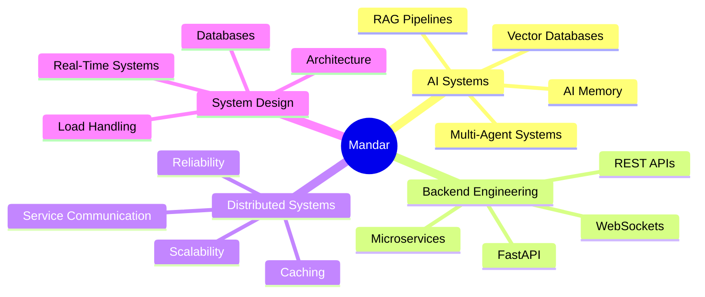

<div align="center">

# 👋 Hey, I'm Mandar Suryavanshi

### Building intelligent systems with AI, Backend Engineering & System Design

<p>
<a href="YOUR_LINKEDIN_URL">

</a>

<a href="https://github.com/mandar-1dev">

</a>
</p>


</div>

---

# 🧠 About Me

```text id="mnd01"
I don't just want to build AI applications.

I want to understand the systems behind them.

How do AI agents collaborate?
How does memory persist?
How do services communicate?
What happens when the system scales?

That's where my curiosity begins.
```

I'm a **Computer Science & Data Science student** passionate about building systems at the intersection of:

> 🤖 **Artificial Intelligence** × ⚙️ **Backend Engineering** × 🌐 **Distributed Systems**

I enjoy transforming ideas into systems that are:

```text id="mnd02"
Intelligent 🧠
        ↓
Scalable 📈
        ↓
Reliable ⚡
        ↓
Production-Oriented 🚀
```

* 🔭 Building **AI Agents and Multi-Agent Systems**
* 🧠 Exploring **AI Memory, RAG and Vector Databases**
* ⚙️ Developing backend systems with **Python & FastAPI**
* 🌐 Learning **Distributed Systems & Microservices**
* 🏗️ Deepening my understanding of **System Design**
* 🌱 Continuously improving **DSA and problem-solving skills**

---

# 🚀 Featured Projects

<table>
<tr>

<td width="50%" valign="top">

## 🤖 AI Multi-Agent Operating System

A system where specialized AI agents collaborate to perform complex tasks through planning, research, memory retrieval and response generation.

### ⚡ Core Capabilities

* Agent Orchestration
* Long-Term Memory
* Tool Calling
* Context Retrieval
* Collaborative Task Execution

### 🛠️ Tech

`Python` · `FastAPI` · `LangChain` · `LangGraph`
`Redis` · `Vector DB` · `Docker` · `React`

<br>

<a href="YOUR_MULTI_AGENT_REPO_URL">

</a>

</td>

<td width="50%" valign="top">

## 🎯 Distributed AI Interview Simulator

An AI-powered interview simulation platform supporting real-time voice and text interaction, adaptive questioning and performance evaluation.

### ⚡ Core Capabilities

* Real-Time Interaction
* Voice + Text Interviews
* Adaptive Questioning
* Performance Evaluation
* Analytics-Based Feedback

### 🛠️ Tech

`Python` · `FastAPI` · `WebSockets`
`React` · `PostgreSQL` · `Whisper AI` · `Docker`

<br>

<a href="YOUR_INTERVIEW_SIMULATOR_REPO_URL">

</a>

</td>

</tr>

<tr>

<td width="50%" valign="top">

## 🧠 AI Memory Engine & Knowledge OS

A persistent memory system designed for semantic search, long-term context retention and personalized knowledge retrieval.

### ⚡ Core Capabilities

* Semantic Search
* Long-Term Context
* Vector Embeddings
* Context Retrieval
* RAG Pipelines

### 🛠️ Tech

`Python` · `FastAPI` · `PostgreSQL`
`Redis` · `Vector Databases` · `RAG`

<br>

<a href="YOUR_MEMORY_ENGINE_REPO_URL">

</a>

</td>

<td width="50%" valign="top">

## ✈️ Intelligent Airport Digital Twin

An enterprise-style airport operations platform simulating the complete airport ecosystem — from passenger check-in and baggage handling to aircraft takeoff and landing.

### ⚡ Core Capabilities

* Flight Scheduling
* Gate Assignment
* Runway Optimization
* Predictive Analytics
* Real-Time Monitoring
* Anomaly Detection

### 🛠️ Tech

`Python` · `Streamlit` · `SQLite`
`Pandas` · `NumPy` · `Plotly` · `Scikit-learn`

<br>

<a href="https://github.com/mandar-1dev/Airport-Management">

</a>

</td>

</tr>
</table>

---

# 🧩 My Engineering Focus



---

# 🛠️ Tech Stack

## 🐍 Primary Engineering Stack

<p>

</p>

> **My strongest project focus is Python-based AI systems, FastAPI backend development, databases, caching and scalable architecture.**

---

## 👨‍💻 Programming Languages

<p>

</p>

---

## 🤖 AI & Intelligent Systems

<p>


</p>

---

## ⚙️ Backend & Real-Time Systems

<p>

</p>

<p>


</p>

---

## 🗄️ Databases & Infrastructure

<p>

</p>

---

# 🌐 How I Think About Systems

```text id="mnd04"
                         USER
                           │
                           ▼
                    ┌─────────────┐
                    │   API / App │
                    └──────┬──────┘
                           │
             ┌─────────────┼─────────────┐
             │             │             │
             ▼             ▼             ▼

        SERVICE A      SERVICE B      AI AGENTS
             │             │             │
             └─────────────┼─────────────┘
                           │
                           ▼
                    ┌─────────────┐
                    │    REDIS    │
                    │    CACHE    │
                    └──────┬──────┘
                           │
                           ▼
                    ┌─────────────┐
                    │  DATABASE   │
                    └─────────────┘
```

When building a system, I like asking:

```text id="mnd05"
1. How does it work? ⚙️

2. How does it scale? 📈

3. What happens if it fails? ⚠️

4. Where should data live? 🗄️

5. How can we make it intelligent? 🤖
```

---

# 📚 Currently Exploring

<table>
<tr>

<td width="25%" align="center">

## 🤖

### Agentic AI

AI Agents
Tool Calling
Agent Orchestration

</td>

<td width="25%" align="center">

## 🧠

### AI Memory

Long-Term Memory
Semantic Search
Knowledge Systems

</td>

<td width="25%" align="center">

## 🌐

### Distributed Systems

Scalability
Service Communication
Reliability

</td>

<td width="25%" align="center">

## 🏗️

### System Design

Architecture
Caching
Databases
Microservices

</td>

</tr>
</table>

---

# 🌱 Open Source Journey

```text id="mnd06"
2026
 │
 ├── 🌟 GirlScript Summer of Code
 │     └── AI / ML Open Source Contributions
 │
 ├── 🌟 Nexus Spring of Code
 │     └── Distributed Systems & Backend Tooling
 │
 └── 🚀 Building, Learning & Contributing...
```

I enjoy contributing to open-source projects because it gives me the opportunity to understand:

**Real Codebases → Collaboration → Code Reviews → Debugging → Production Workflows**

---

# 📊 GitHub Activity

<div align="center">


</div>

<br>

<div align="center">


</div>

---

# 🎯 My Current Mission

```python id="mnd07"
class Engineer:
    interests = [
        "AI Systems",
        "Backend Engineering",
        "Distributed Systems",
        "System Design",
        "Open Source"
    ]

    def mission(self):
        return "Build intelligent systems that scale 🚀"


me = Engineer()

print(me.mission())
```

---

# 💭 Engineering Philosophy

> **Don't just build something that works.**
>
> **Build something you understand.**
>
> **Then learn how to make it scalable, reliable and intelligent.**

```text id="mnd08"
BUILD
  ↓
LEARN
  ↓
BREAK
  ↓
DEBUG
  ↓
IMPROVE
  ↓
SCALE
  ↓
REPEAT 🚀
```

---

<div align="center">

# 🤝 Let's Connect

### I'm always interested in connecting with people building:

**AI Systems 🤖 · Backend Infrastructure ⚙️ · Distributed Systems 🌐 · Open Source 🔓**

<br>

<a href="YOUR_LINKEDIN_URL">

</a>

<a href="mailto:YOUR_EMAIL">

</a>

<br><br>

---

### ⚡ Building the systems behind intelligent software.

**AI → Architecture → Scale → Impact**

⭐ Feel free to explore my repositories!

</div>
